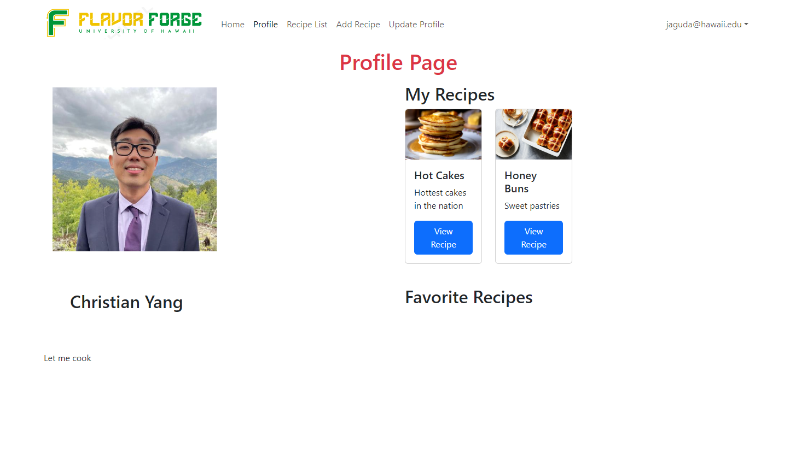
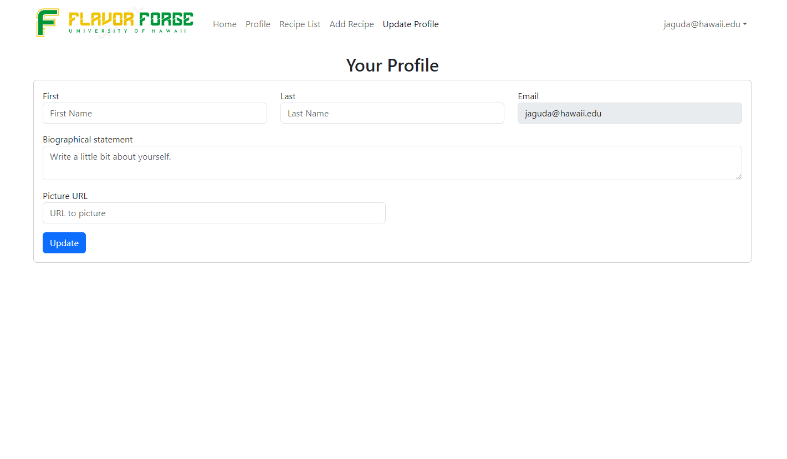

[flavor-forge](https://flavor-forge.github.io)

<h1>FlavorForge</h1>
<h3>Team Members</h3>

 - Jason Aguda
 - Angello Portillo
 - Weibin Wu
 - Christian Yang
 - Junjie Yu

<h3>Project Overview</h3>
<h4>Home Page</h4>

    

    <h4>Recipe List Page</h4>

    

    <h4>Recipe Page</h4>

    

 <h4>Add Recipe Page</h4>

    

<h4>Profile Page</h4>

    

<h4>Edit Profile Page</h4>

    

<h3>Team Role</h3>
&ensp;My role on the team was very much organizational on top of the work I did to assist the development on the project. Often I would organize the meeting times and try to structure the project and issues in a way that would make it easy for everyone in the project. I did not do this duty alone as my team members assisted in organizing as well but I was the most contributing member in this regard with Angello contributing the second most. Often times Angello and I would discuss what each of our visions of our project looked like while Jason would suggest improvements to our design plans. After we had discussed the plan and finalized our decisions we were left with assigning the issues to each team member. This started off by dividing the issues by their respective page on the webapp. I asserted that I believed it would be the most beneficial to have individuals focus on a specific web page that we planned to implement. This involved both front-end and back-end since nobody in our group had expressed an interest in working on solely one side. I thought this would be the easiest way to divide the tasks so that most of the moving pieces that interact with each other would be handled by the same person. This would allow the team members to each "specialize" so to speak and possibly streamline any work that may be a redundancy. We were not able to completely distribute the issues this way as it would have been too strenuous on an individual to handle some tasks alone.

<h3>Personal Contribution</h3>
&ensp;As for my developmental contributions to the project I handled the Home Page, the Recipe Page, as well as assisted the other members on many of their issues. The Home Page is simple and the main component of interest is the Featured Recipes card that filters the list of recipes in the Recipes collection and picks one of the recipes to display at random by generating a random key that correlates to the filtered array. The Recipe Page began as another team members issue but they ran into an issue where the page would no longer be able to access the recipe information from the array after it was refreshed. He became frustrated with this issue and asked me for assistance which is why I stepped in to help. Lastly I assisted a different team member with their issues with the profiles page. Profiles would not be able to access the user profile information after clicking the profiles link. There was a similar issue for the edi profiles page as well. I resolved many of the back-end issues for my team members and helped them with anything they needed.

&ensp; From this experience I learned a lot about working on a software project with a team. In my previous projects I had done most of the programming myself and did not need to how the moving parts of a team should function. I learned a lot about communication and what is required to have a team work seamlessly together without any problems. In order to work together as one unit you need proper communication and accountability. In the start of our project, our team created a team contract that outlined the duty we had to one another as team members. It simply stated that all team members must stay in communication with one another and be upfront and responsible for their progress. During the project when a team member was not participating in the discussions about the project we referred back to the contract. It reminded them that this was something they agreed to and held them accountable. This was an important step in our team bonding process as we all were held accountable and it ended with a successful deployment of the website. I also learned a lot about Meteor and Javascript by applying what I learned from class to various functions. I previously had very little experience with any back-end development. I was familiar with arrays and object oriented programming but I had never applied them to a project of this scale. Usually I would work on smaller programming problems given to me by my instructor or from [Leetcode](https://leetcode.com/). Previously I felt like I was a novice when it came to programming and working on something functional like this was far out of reach. After working on this project I feel a lot more confident in my abilities. I do realize I am still a long way from truly mastering programming and becoming fluent in any one language, but I feel like I have taken a large step towards my potential.