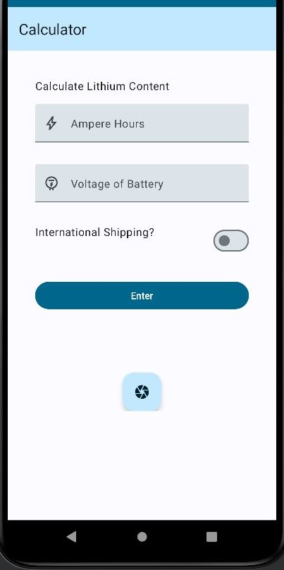
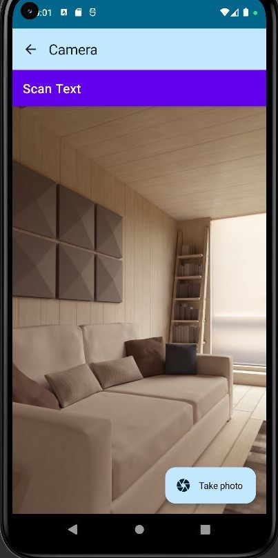

<div class="text-center p-4">
  
  
</div>

The Lithium Content Calculator is a simple calculator that takes in the specifications of a lithium ion battery, such as ampere-hours and voltage, and calculates the lithium content in grams. The calculator also has the capability to scan the text from an image and fill the text-fields with the corresponding values for the ampere-hours and voltage. The application utilizes the device's built-in camera and can capture an image for scanning. The calculator utilizes the Google MachineLearning Kit Library's functions to scan text from a corrected bitmap and outputs the desired text as a string. The scanned text will then be displayed in the entry fields for the user to adjust if necessary.

For this project, I was the lead programmer who was responsible for programming the various capabilities of the mouse.  I started by programming the basics, such as sensor polling and motor actuation using interrupts.  From there, I then programmed the basic PD controls for the motors of the mouse.  The PD control the drive so that the mouse would stay centered while traversing the maze and keep the mouse driving straight.  I also programmed basic algorithms used to solve the maze such as a right wall hugger and a left wall hugger algorithm.  From there I worked on a flood-fill algorithm to help the mouse track where it is in the maze, and to map the route it takes.  We finished with the fastest mouse who finished the maze within our college.

This project was completed alone with the help of my Project Advisor, Dr. Galen Sasaki, from the University of Hawaii at Manoa. In the beginning of the project I started with minimal knowledge on Java, Kotlin, and Android development. I had to learn Kotlin from the Android Development tutorial available online as well as going through tutorials on Google's ML Kit and the functions I would be utilizing. I began by first using what I learned from the Kotlin tutorial to create a simple calculator application. The next step was to add the Camera and text scanning capabilities using the CameraX and Google ML Kit libraries. I created new UI elements and functions to ask the user for camera permissions, open the camera screen using the device's buit-in camera. Then I added a button to capture a bitmap using the camera, a function correct the rotation for the bitmap, and fed the corrected bitmap to another function that would read and convert the text in a bitmap to a string. The program would parse through the string and fill the desired values into the editable text field for the user to use in their calculations. The calculator would output the lithium content in grams, as well as mail carriers that would allow the shipment of a battery of that size.

Here is some code that illustrates how we scan for text using an image:

```cpp
@Composable
fun AnalyzeText(
    textRecognizerViewModel: TextRecognizerViewModel = viewModel(),
    imToAnalyze: (Bitmap),
    onMAMPH: (String) -> Unit,
    onV: (String) -> Unit,
    onVolt: (String) -> Unit,
    onScanSuccess: () -> Unit,
) {

    val recognizer = TextRecognition.getClient(TextRecognizerOptions.DEFAULT_OPTIONS)
    val mamphPattern = Regex("""(\d+)mAmpH""")
    val vPattern = Regex("""(\d+)V""")
    val voltPattern = Regex("""(\d+) Volt""")


    val inImage = InputImage.fromBitmap(imToAnalyze, 0)
    recognizer.process(inImage)
        .addOnSuccessListener { visionText: Text ->
            val detectedText: String = visionText.text
            if (detectedText.isNotBlank()){
                val mamphMatch = mamphPattern.find(detectedText).toString()
                val vMatch = vPattern.find(detectedText).toString()
                val voltMatch = voltPattern.find(detectedText).toString()
```

