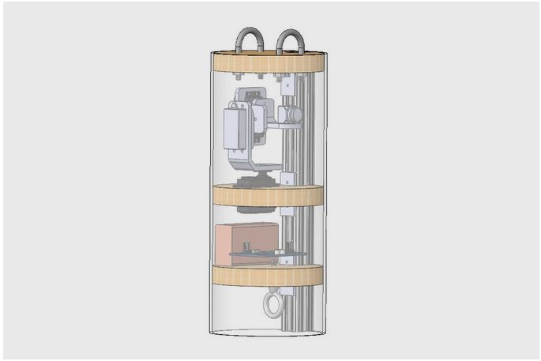

  

I was a member of Team Hokulele's payload sub-team which was led by Matthew Young for my EE 296 project. The goal of our team was to design a 360 degree camera array mounted on a gimbal and a payload deployment system. In the Spring 2021 semester, Team Hokulele was still in the planning and designing stages of their project and my responsibilities were focused on research and planning. During this period the team members researched which materials would work best for the design as well as the projected budget. Various problems in the previous year's design were addressed and the payload needed to be completely re-designed.

Matthew had come up with his updated design and we discussed which programming languages we felt most comfortable with and chose to use Arduino electronics for the payload. Arduino language is just a set of C/C++ functions and this coincided with what I had encountered in classes so far. Unfortunately due to COVID-19 keeping classes online and limiting fundraising opportunities, there was uncertainty whether the components for a new payload were attainable. Most of the teams time was focused on addressing other issues with the payload, since it was a completely new idea our project advisor Dr. Sorenson often would check in with us and discuss concerns he had for the design of the casing. Ensuring visibility for the camera was a big problem since the casing material needed to be very durable and able to withstand an sizeable impact. Matt had tasked me to pre-emptively research the Arduino language libraries, specifically to look at the servo-motor control functions, gyroscope measurement functions, as well as writing an algorithm for the program to control the manufactured gimbal. The functions were straight forward and read in pitch and yaw values to correct motors accordingly. The gyrposcope functions output values for the x, y, and z axis which then can be converted to degrees per second using a simple equation. 

Due to the uncertainty of the budget and if classes would resume in-person attendance in the following semseter, the team ultimately decided agaisnt going forward with the programming in the Spring. There were many other issues to be addressed and Matthew decided it was best to not waste time writing a program that needed to be converted to fit a different language later.
